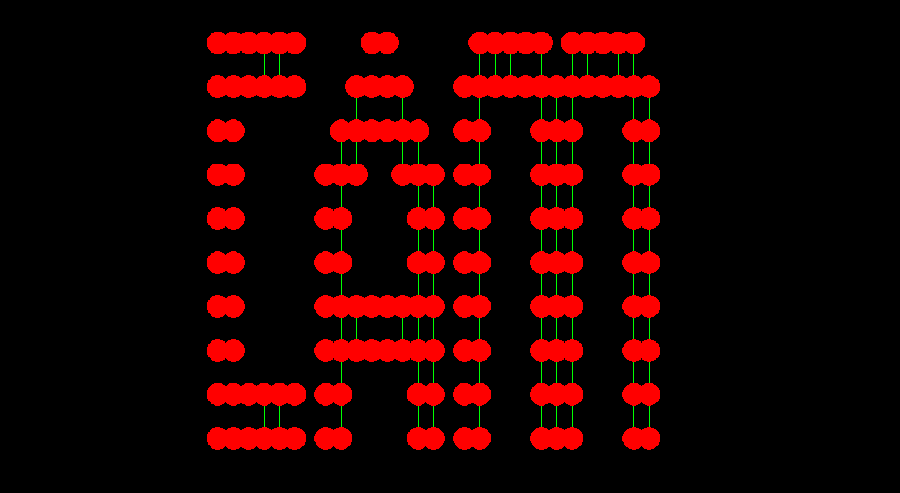

# Graph Implementation
Tested + includes useful animation.

Converts 2D matrix into graph where 1 indicates a vertex and 0 indicates no
vertex.

*Note: this is not a traditional adjacency matrix.*

## Example

